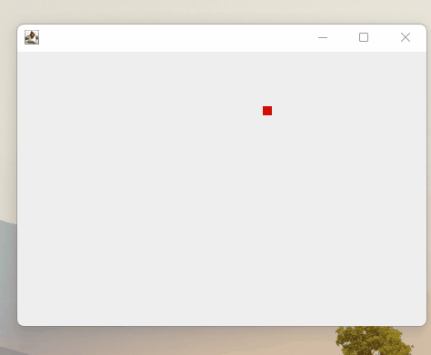
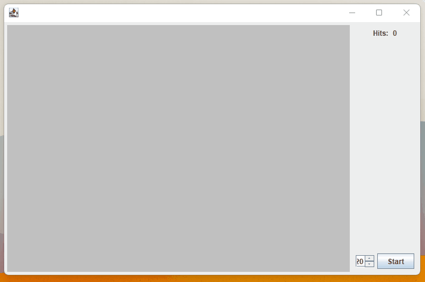

# Feladatok

## 1. Feladat DVD logó

Készítsd el az ismert pattogó DVD logó Javás verzióját. Az alkalmazás megnyitása után egy pirosra színezett JPanel
induljon el valamelyik irányba, és ha eléri a keret szélét, akkor pattanjon vissza róla.

## 2. Feladat Ütközések

Az első feladothoz hasonlóan készítsd el az alábbi alkalmazást. Legyen egy terület, ahol a piros négyzetek mozogni
tudnak, legyen egy gomb, amivel spawnolni lehet a piros négyzeteket. Legyen egy JSpinner, amivel meg lehet adni a
négyzetek számát. A gomb megnyomására, a JSpinnerben meghatározott számú négyzet megjelenik a felületeten és elindulnak
valamilyen irányba. Ha két négyzet ütközik egymással vagy a fallal, növeld meg az ütközés számláló értékét.

