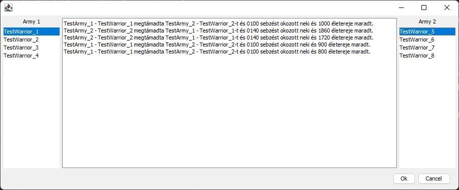

# Wargame

## Leírás:

A feladatotok egy háborús játék létrehozása lesz.

Készíts egy **Warrior** osztályt ami eltárolja a harcos _nevét_, _életerejét_ és _támadási értékét_.

Készíts egy **Army** osztályt ami **Warrior** objektumokat tárol valamilyen kollekcióban. Az **Army** osztálynak
ezen túl van egy _név_ mezője és megvalósít egy _getWarrior()_ metódust. A metódus kivesz a kollekcióból egy harcost és
vissza tér vele. Az **Army** osztály létrehozásakor valamilyen módon meg lehessen adni, hogy mi alapján adjon a metódus
vissza egy harcost.

Lehetséges módok:

- A legerősebb először (A legnagyobb támadási értékkel rendelkező harcost adja vissza)
- A legszívósabb először (A legnagyobb életelővel rendelkező harcost adja vissza)
- Véletlenszerű

Készíts egy **War** osztályt, aminek van egy _battle()_ metódusa, ami két **Army**-t vár paraméterül. Mindkét **Army**
-ból, elkér egy-egy harcost és a harcosok addig küzdenek egymással amíg valamelyik meg nem hal. A harc két harcos között
a következőképpen zajlik, minden körben véletlenszerűen kiválasztjuk valamelyik harcost a kettő közül aki megtámadja a
másikat. Ilyenkor a támadó támadási értékét levonjuk az áldozat életerejéből, ha maradt életereje vissza támad. A
következő körben megint véletlenszerűen választjuk, hogy melyik harcos támad először és ezt addig ismételjük, amíg
valamelyik harcos meg nem hal. A meghalt harcos helyére új harcos kerül a saját hadseregéből. A háború addig zajlik,
amíg valamelyik hadseregből el nem fogynak a harcosok.

Minden tevékenységet irass ki a konzolra, a következő formátumban:

`[Hadseregnév][Harcosnév] megtámadta [Hadseregnév][Harcosnév]-t és [X: 4 helyiértéken minden esetben] sebzést okozott neki`

Halál esetén:
`[Hadseregnév][Harcosnév] elhullott a csatában [Hadseregnév][Harcosnév] keze által`

A _main()_ metódusba hozz létre két hadsereget 10-10 harcossal és nézd meg különböző kiválasztási stratégiákkal ki nyer.

## Kiegészítés:

Egészítsd ki az elkészült alkalmazást a következőképpen:

- Készíts egy **WarriorGenerator** osztályt, ami harcosok létrehozására szolgál. Az osztály konstruktorba kapja azt az
  intervallumot, amin belül a támadási érték és az életerő értéket vehet fel. Készíts két .csv fáljt vezeteknev.csv és
  keresztnev.csv néven és vegyél fel 10-10 sort mindkét fáljba. Az osztály töltse be a vezetékneveket és a
  keresztneveket 1-1 megfelelő adatszerkezetbe majd ezekből építse fel a harcosok nevét. A **WarriorGenerator** osztály
  valósítson meg egy getWarriors(int numbersOfWarriors) metódust, ami egy harcos listával tér vissza. Oldd meg, hogy a
  listán belül két harcos ne kapja ugyan azt a nevet. (Ne foglalkozz azzal az esettel, ha több harcost kellene
  generálni, mint amennyi név lehetséges).

- Készíts egy **ArmyManager** osztályt, aminek két statikus metódusa van:
    - saveArmy(Army army, String fileName): Ami egy Army objektumot JSON formátumba a megadott fájlba írja.
    - loadArmy(String fileName): Ami egy JSON fájlből betölt egy Army objektumot.

- Készíts egy **Logger** osztályt, amit felhasználva a korábban a konzolra írt üzeneteket egy logfile.txt-be írod a
  konzol helyett. A korábbi üzenet formátumot egészítsd ki egy [TimeStamp] taggal, ami a másodperc pontos dátumot
  tartalmazza és az üzenet elején van.

- A main metódusba mutasd be az új osztályok használatát

A megoldás során bármilyen segítséget használhatsz!

## Felhasználói felület:

Készíts az alkalmazáshoz felhasználói felületet, ami az alábbi funkciókat tudja.

- Képes megjeleníteni a két hadsereg nevét és a bennük lévő harcosok listáját.
  - Ha egy harcos elesik, kerüljön ki a listából.

- Képes megjeleníteni a harcok szöveges leírását.

- A háború végeztével egy előugró ablakban jelzi, melyik hadsereg győzőtt.

Példa: 

